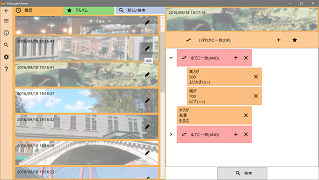
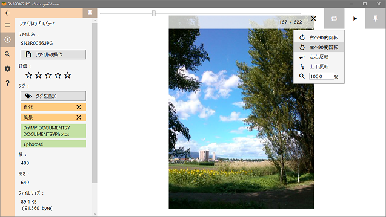
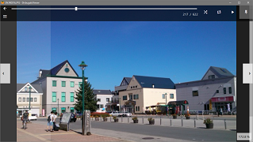
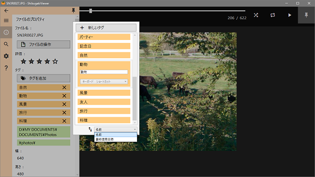
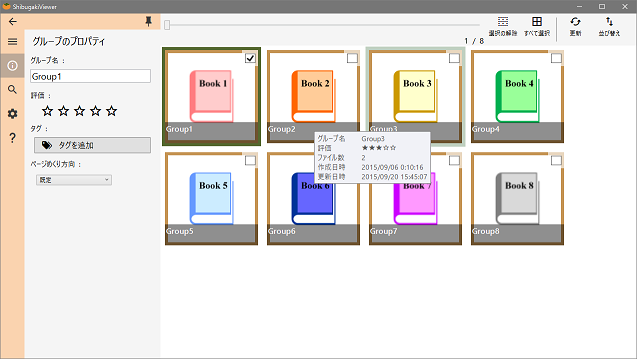
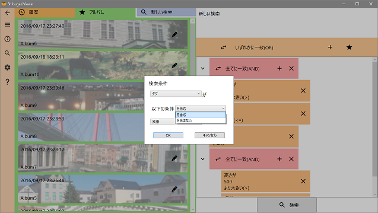
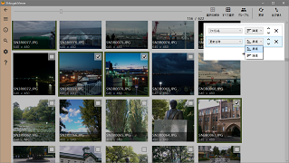
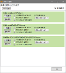

ShibugakiViewer
===========

画像ファイルの管理・表示アプリ

for Windows 7/8/8.1/10

---

  
登録されたフォルダ内の画像ファイルをライブラリ化し、条件を指定して検索することができます。

---
### 画像の表示

  
画像を拡大、縮小、回転して表示できます。  
  
画像を自動で切り替えるスライドショー機能があります。  
スライドショーの再生中は画像をフルスクリーンで表示できます。  

  
ウインドウの背景色は任意に設定可能です。

---
### 画像データベース

  
登録された画像にタグを付けて管理します。  
キーボードショートカットを設定すると、素早くタグを設定することができます。  
タグをタップすることで、同じタグを含む画像を抽出します。  

  
また、画像のグループ化を使用すると、電子書籍などの管理がより便利になります。  
グループにもタグや評価の設定が可能です。  
  
  
画像のサイズ、作成日時、タグ、評価などの条件を指定し、一致する画像を検索します。  
"AND/OR"を使用した詳細な条件の設定が可能です。  
  

  
検索結果を表示する際、複数のソート条件を設定することが可能です。  
例えば評価が高い順番に並べたうえで、評価が同じ場合は更新日時が新しい順番に並べることができます。  

  
  
画像の入ったフォルダを登録します。  
アプリの起動中はフォルダ内の画像の追加・削除を監視し、自動でライブラリを更新します。  

---
### 対応ファイル形式

以下の画像形式に対応しています。  
` ".png", ".jpg", ".jpeg", ".bmp", ".gif", ".wmf", ".emf", ".tif", ".tiff"`  
  
GIFアニメーションの再生が可能です。  
  
ベクタ形式画像(`".wmf", ".emf"`)を、品質を保ったまま拡大して表示することができます。

