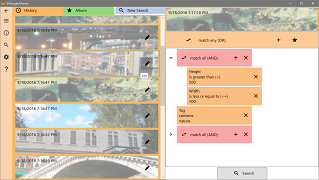
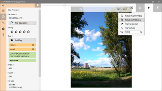
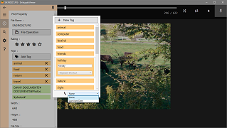
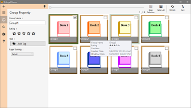
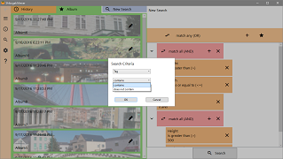
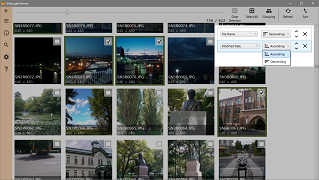

[Japanese](README_ja.md)

ShibugakiViewer
===========

Manager and Viewer App for Image Files

for Windows 10

.NET Core Desktop Runtime 3.1 or higher is required.

[Release Notes](ReleaseNotes.md)

---

  
This app makes library from image files in registered folders.  
You can find images in a custom criteria.

---
### View Images

  
Image scaling, rotation, and management  
  
There is the slideshow mode which change the image automatically.  
You can view the image in full screen during slideshow.  

  
Choose a favorite color for the background of viewer.

---
### Image Database

  
Register folders containing images.  
While the app is running, it monitors the addition and removal of the images in the folder, and updates the library automatically.
  
  
Use tags to manage registered images.  
By tapping the tag, images with the same tag will be enumerated.  
By using a keyboard shortcut, you can set the tag quickly.  
  
  
Management of images will be more convenient by grouping of items such as e-books.  
You can also set tags or rating to the group.  
  
  
Search for your images by size, created date, tag, rating or other file properties.  
To set more detailed condition, use the "AND/OR" operator.  
By saving the search criteria to the album, you can use it again.  
  
  
You can set multiple sort conditions when displaying the search results.  
For example, sort images first by rating and then by modified date in each group of same rating.  

---
### Supported file formats

It supports the image format of the following:  
` ".png", ".jpg", ".jpeg", ".bmp", ".gif", ".wmf", ".emf", ".tif", ".tiff", ".webp"`  
  
Animated GIF is supported.  
  
Vector image formats(`".wmf", ".emf"`) can be enlarged while maintaining the quality.

---
[Project Home](https://boredbone.github.io/ShibugakiViewer/)

